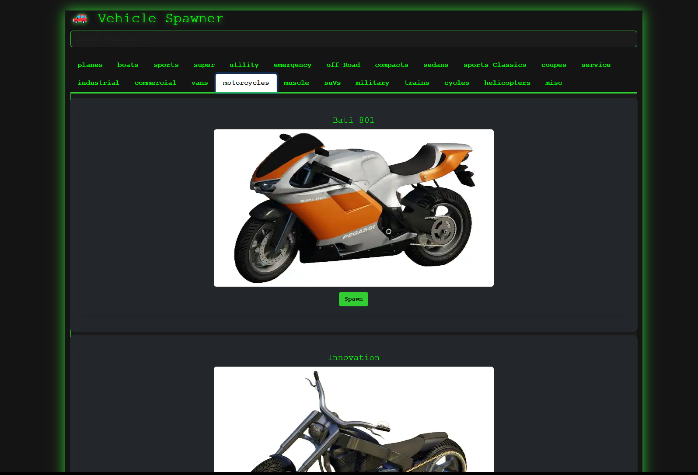

# Vehicle Spawn Menu

A modern, user-friendly FiveM NUI vehicle spawner for GTA V, built with C# (.NET Framework 4.5.2), JavaScript, and Bootstrap. This resource provides a categorized, searchable, and visually appealing menu for spawning vehicles in-game.

## Features

- 🚗 **Vehicle Spawner**: Instantly spawn any vehicle from categorized tabs.
- 🔍 **Search**: Real-time, debounced search for quick filtering.
- 🏷️ **Categories**: Vehicles grouped by type (Super, Sports, Offroad, Emergency, Boats, Planes, Helicopters, Trains, Misc).
- 🖼️ **Images**: Each vehicle displays an image (expects images in `images/` as `<model>.webp`).
- 🎨 **Modern UI**: Responsive, dark-themed interface using Bootstrap 5 and custom CSS.
- 🖱️ **Mouse & Keyboard**: Open/close with F2 or Escape, or via `/openvehmenu` command.
- 🛠️ **Extensible**: Easily add new vehicles or categories.

## Screenshots

 
 

## Installation

1. **Clone or Download** this repository into your FiveM resources folder.

2. **Build the Resource**  
   - Open the solution in Visual Studio 2022.
   - Build both the Client and Server projects (ensure references to `CitizenFX.Core` and `Newtonsoft.Json` are resolved).
   
3. **Add to `server.cfg`**  
   - ensure vehicle_menu 
   
4. **Images**  
- Images are included in webp format.
- Missing images will show as broken images in the menu.

## Usage

- Press **F3** in-game to open the menu, or use the `/openvehmenu` command.
- Search for vehicles by name or category.
- Click **Spawn** to instantly spawn the selected vehicle.

## Commands

- `/openvehmenu` — Opens the vehicle menu.
- `/spawncar <model>` — Spawns a vehicle by model name (for testing/debug).

## Development

- **Client**: C# (.NET 4.5.2, CitizenFX.Core)
- **Server**: C# (.NET Standard 2.0, CitizenFX.Core.Server)
- **UI**: HTML, CSS (Bootstrap 5), JavaScript

### Building

- Open in Visual Studio 2022.
- Build the solution. 
- Edit build.cmd OUTDIR to point to your FiveM resources directory, e.g., `OUTDIR=..\resources\vehicle_menu`.
-  Run `build.cmd` to compile and copy files.

### Customization

- To add or remove vehicles, edit the logic in `ClientMain.cs` or update your vehicle image assets.
- UI can be customized via `style.css` and `index.html`.

## Credits

- [CitizenFX/FiveM](https://fivem.net/)
- [Bootstrap](https://getbootstrap.com/)
- [Newtonsoft.Json](https://www.newtonsoft.com/json)

## License

CC0 V1 License.
